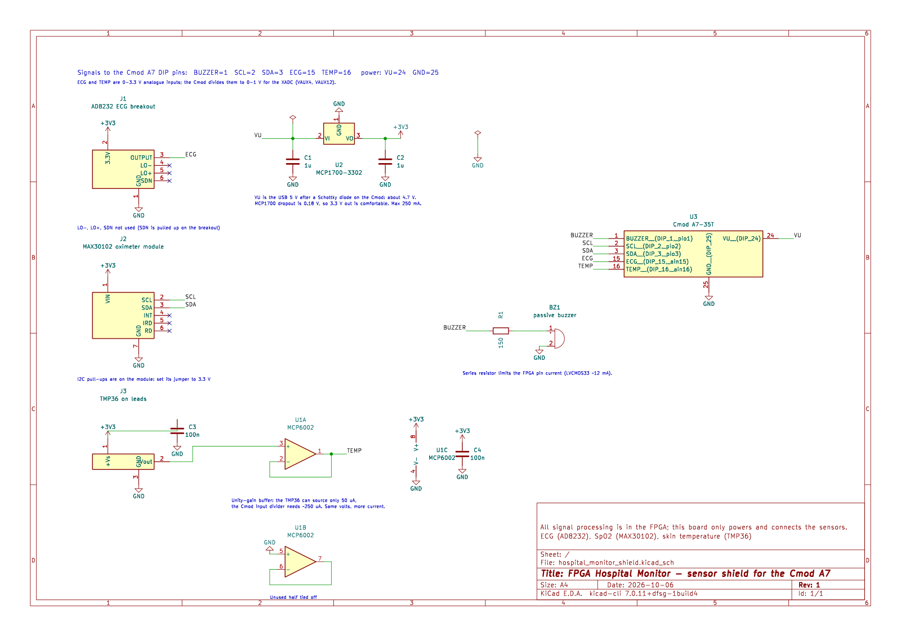
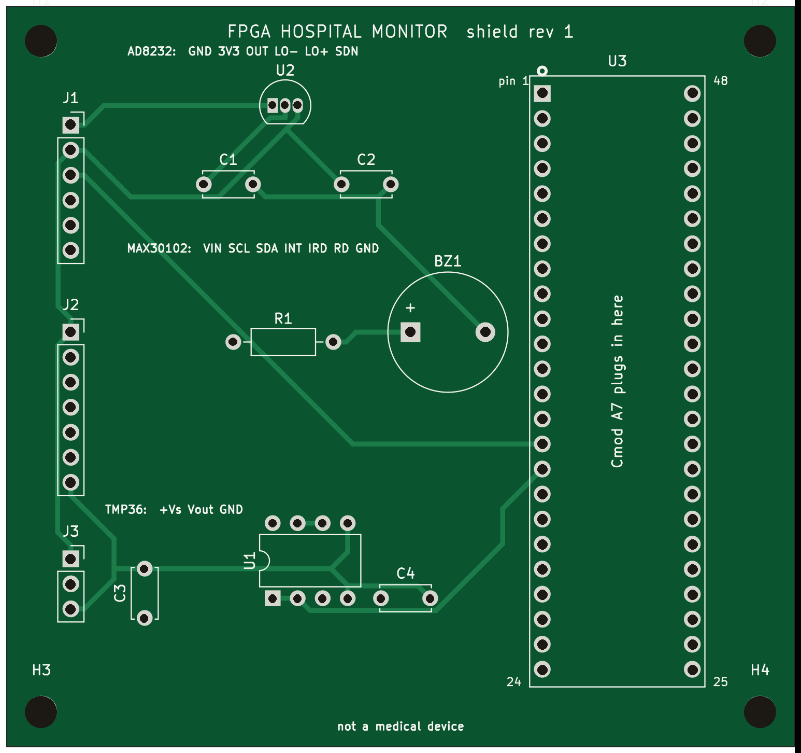

# FPGA Hospital Monitor

A three-channel patient monitor built on an FPGA: **ECG and heart rate**,
**blood oxygen (SpO₂)** and **skin temperature**, shown on a hospital-style
display.

The sensors are bought modules. Everything after them — the ADC control,
the I²C bus master, filtering, baseline removal, beat detection, the
heart-rate divider, the ratio-of-ratios oximetry maths, temperature
conversion, and the serial link — is Verilog running on a Digilent
Cmod A7-35T. The laptop only draws what it is sent.

The beat detector is scored against cardiologist annotations from the
PhysioNet MIT-BIH Arrhythmia Database, so its accuracy is a measured figure
rather than an impression.

> **Not a medical device.** Hobby and education only. Do not use it for
> diagnosis or treatment.

---

## The signal chain

```
 electrodes          fingertip             skin
     |                   |                   |
  AD8232             MAX30102              TMP36
  amp + filters      red + IR LEDs,        10 mV / °C
  (bought)           18-bit ADC (bought)   (bought)
     |                   |                   |
     |                   |             op-amp buffer     <- needed, see Wiring
     |                   |                   |
     v                   v                   v
   XADC VAUX4         I²C bus             XADC VAUX12
     |                   |                   |
 xadc_reader       i2c_master           xadc_reader
 (2 channels,      max30102_driver      (same block)
  sequencer)           |                     |
     |             spo2_calc             temp_convert
     |             udiv (44-bit)             |
     |                   |                   |
 ecg_filter              |                   |
 baseline_remove         |                   |
 beat_detect             |                   |
 bpm_calc / bpm_div      |                   |
     |                   |                   |
     +-------------------+-------------------+
                         |
                  telemetry_uart        S/B/T/O messages, 115200 baud
                         |
                  scripts/ecg_monitor.py --port COMx
```

`buzzer` and `led_flash` hang off the `beat` pulse.

---

## What goes over the serial line

Every message is six characters: a tag, four decimal digits with leading
zeros, newline.

| Message | Meaning | How often |
|---|---|---|
| `S2048` | one raw ECG sample, 0–4095 | 500 / s |
| `B0075` | heart rate, BPM | once per beat |
| `T0345` | skin temperature, tenths of °C (34.5 °C) | 2 / s |
| `O0098` | SpO₂ percent. `O0000` = no finger. `O0999` = MAX30102 not responding | every 2.6 s |

Bandwidth: the sample stream is 500 × 6 × 10 = 30,000 bit/s; the rest is a
few messages a second. About 27 % of the 115,200 baud line.

Measured on hardware: 0 bad lines in 114,000 messages.

---

## Hardware

| Part | Notes |
|---|---|
| Digilent Cmod A7-35T | 48-pin DIP, has the XADC built in |
| AD8232 breakout | ECG front end. Run it at **3.3 V**, not 5 V |
| ECG electrode pads + 3-lead snap cable | the cable plugs into the AD8232's 3.5 mm jack |
| MAX30102 module | pulse oximeter, I²C. **Pull-up jumper must be on 3.3 V** — see below |
| TMP36 | analogue temperature sensor, TO-92 |
| MCP6002 or LM358 | dual op-amp, used as a unity-gain buffer for the TMP36 |
| 0.1 µF capacitor | decoupling for the TMP36 |
| Passive buzzer + 100–220 Ω resistor | magnetic types need a transistor instead |
| Full-size breadboard + male jumpers | the Cmod straddles the centre channel |

### The Cmod A7 pins this design uses


**Only two of the 48 DIP pins are power:** pin 24 (VU) and pin 25 (GND).
There is **no 3.3 V on the DIP header** — it is only on the Pmod socket.
With USB attached the board drives about 4.7 V *out* onto pin 24, which
would damage every sensor here. Power all three from Pmod JA pin 6 (or 12).

DIP pins 15 and 16 each pass through an on-board 2.32 kΩ / 1 kΩ divider,
so they accept **0 to 3.3 V** and present 0 to 1 V to the XADC. One ADC
count is therefore 3.32 V / 4096 = **0.81 mV** at the pin (measured: 4051
counts on the 3.28 V rail). The negative half of each pair (G2, J2) is
grounded on the board, so they are single-ended inputs. With nothing
connected, the 1 kΩ leg holds the pin at 0 V, so an unwired input reads 0.

### Wiring: AD8232 (ECG)

| AD8232 | Cmod A7 |
|---|---|
| 3.3V | Pmod JA pin 6 |
| GND | Pmod JA pin 5, or DIP pin 25 |
| OUTPUT | DIP pin 15 (`xa_p[0]`, package pin G3, VAUX4) |

Electrode cable into the 3.5 mm jack. IEC colours: **red** just below the
right collarbone, **yellow** just below the left collarbone, **green** on the
lower left ribs. On the soft flesh, not on the bone. If the R peak comes
out pointing down, swap red and yellow.

### Wiring: TMP36 (skin temperature) — needs the buffer

The TMP36 can only source **50 µA**. The Cmod's input divider draws about
**250 µA** at the voltages involved, so connected directly the sensor's
output collapses and the reading is garbage. A unity-gain op-amp buffer
in between fixes it: the op-amp copies the voltage and supplies the current.

```
   TMP36 (flat face towards you, legs down):   +Vs   Vout   GND

   +Vs  ─── Pmod JA 3.3 V        (0.1 µF from +Vs to GND, close to the sensor)
   GND  ─── GND
   Vout ─── op-amp IN+ (pin 3)

   MCP6002 / LM358, DIP-8, same pinout for both:
       pin 8  V+   ─── Pmod JA 3.3 V
       pin 4  V−   ─── GND
       pin 3  IN+  ─── TMP36 Vout
       pin 2  IN−  ─── pin 1   (output tied back to the inverting input = gain of 1)
       pin 1  OUT  ─── DIP pin 16  (`xa_p[1]`, package pin H2, VAUX12)
```

Tape the flat face of the TMP36 against skin with something over it to
insulate it from the air. Inner wrist works; armpit reads closer to core.
It reads **skin** temperature, typically 32–35 °C, and is labelled as such
on the display.

### Wiring: MAX30102 (SpO₂)

| MAX30102 | Cmod A7 |
|---|---|
| VIN | Pmod JA 3.3 V |
| GND | GND |
| SCL | DIP pin 2 (`scl`, package pin L3) |
| SDA | DIP pin 3 (`sda`, package pin A16) |
| INT | not used |

**Check the pull-up jumper.** Most of these modules have a three-pad
solder jumper that selects whether the I²C pull-ups go to 1.8 V or 3.3 V.
The FPGA's inputs need 2.0 V to read a logic high, so at 1.8 V nothing
works and nothing explains why. With the module powered, a multimeter from
SCL to GND must read about 3.3 V. If it reads 1.8 V, move the jumper, or
add 4.7 kΩ resistors from SCL and SDA to 3.3 V. The MAX30102's own pins are
rated to 6 V, so 3.3 V pull-ups are fine for it.

Finger on the sensor window, light pressure, keep still. The first reading
takes about 5 s (two 2.56 s blocks).

### Buzzer

DIP pin 1 (`buzzer`, package pin M3) → 100–220 Ω → buzzer **+**. Buzzer **−** to GND.

### Safety

Electrodes on your chest is a different risk category from a sensor
clipped on a finger.

- **Unplug the laptop charger while electrodes are attached.** USB to a
  mains-powered laptop puts you indirectly on mains equipment. Laptop on
  battery, board on USB.
- Use proper single-use ECG pads.
- **Do not power the board from batteries on DIP pin 24 while USB is
  connected.** The reference manual is explicit — "if you have a power
  source attached to the VU pin, you must disconnect it before attaching
  a USB host, or risk damaging it." Since USB carries the data, battery
  power is not an option for this project.
- Insert and remove the Cmod with USB unplugged. Nothing is live until
  USB goes in.

---

## The shield PCB (KiCad)

The breadboard works for bring-up, but three sensor modules, an op-amp and
a regulator on jumper wires is fragile and noisy. `hardware/` holds a KiCad
design for a shield the Cmod A7 plugs into, with everything else soldered
on. Two-layer, 80 × 75 mm, through-hole throughout so it can be built with
an iron.



What is on it, and why:

| Ref | Part | Why |
|---|---|---|
| U3 | Cmod A7 socket, 2 × 24-pin female header, 0.6 in apart | the FPGA plugs in from above |
| U2, C1, C2 | MCP1700-3302 LDO, 2 × 1 µF | makes 3.3 V from VU (DIP pin 24, ~4.7 V), so no flying lead from the Pmod socket |
| J1 | 1 × 6 socket | the AD8232 breakout plugs in |
| J2 | 1 × 7 socket | the MAX30102 module plugs in |
| J3 | 1 × 3 socket | the TMP36 on a short lead, so it can be taped to skin |
| U1, C4 | MCP6002 dual op-amp, 100 nF | unity-gain buffer for the TMP36 (50 µA source limit vs the Cmod's 250 µA input divider); the spare half is tied off |
| C3 | 100 nF | decoupling at the TMP36 supply, as its datasheet asks |
| R1, BZ1 | 150 Ω, passive buzzer | beat beep; the resistor keeps the FPGA pin under its 12 mA rating |
| H1–H4 | M3 holes | so it can be stood off a desk or screwed into a case |

The analogue inputs stay single-ended into DIP pins 15 and 16, as on the
breadboard — the Cmod's own dividers do the scaling — so the Verilog needs
no change to run on the shield.




## How the numbers are worked out

### Heart rate

An 8-point moving average, baseline subtraction, then a threshold
crossing with a 250 ms refractory window so the T wave cannot be counted
as a second beat. The gap between beats in samples goes into a sequential
divider: BPM = 30000 / period.

### Temperature (fixed point, no floating point)

TMP36: 500 mV at 0 °C, 10 mV per °C — so **tenths of a degree = mV − 500**.
Pin: 0.8105 mV per count, written as **830 / 1024**. 256 readings are
summed and the maths is done on the sum, keeping the fractional part of the
average:

```
tenths = ((sum × 830) >> (10 + 8)) − 500
```

One ADC count is 0.08 °C; averaging 256 gives roughly 0.005 °C resolution.
A new value every 0.5 s. (`rtl/temp_convert.v`)

### SpO₂ (ratio of ratios)

Each light reading is a steady level (DC: tissue) plus a small wobble (AC:
blood pulsing). Oxygenated blood absorbs infrared more than red, so

```
       (AC_red / DC_red)
  R = -------------------          SpO₂ ≈ 110 − 25 R       (textbook linear fit)
       (AC_ir  / DC_ir)
```

Per block of 256 samples (2.56 s at 100 sps) and per colour: DC = sum >> 8,
AC = max − min. Then one 44-bit sequential division gives R scaled by 100,
and because 25/100 = 1/4:

```
  R100 = (AC_red × DC_ir × 100) / (DC_red × AC_ir)
  SpO₂ = (442 − R100) >> 2,  clamped to 0..100
```

"No finger" is an IR DC level below 30,000 counts. The linear fit is the
usual learning approximation; real oximeters use a curve calibrated on
volunteers. (`rtl/spo2_calc.v`, `rtl/udiv.v`)

### The MAX30102 driver

Bus recovery (9 clocks + STOP), software reset, read `PART_ID` (must be
0x15), configure — FIFO, ADC range 4096 nA, 100 sps, 411 µs pulses
(18-bit), both LEDs 6.2 mA, clear pointers, **mode last** — then poll the
FIFO write/read pointers every 2 ms and read six bytes per waiting sample.
Any NACK, wrong ID or stuck clock drops `sensor_ok`, waits a second and
starts again, so an unplugged sensor shows `ERR` rather than hanging.
(`rtl/max30102_driver.v`, `rtl/i2c_master.v`)

### Two ADC channels on one XADC

The XADC runs in continuous-sequence mode over VAUX4 and VAUX12. At each
end-of-conversion the channel number is latched and that channel's result
register is read over the DRP one clock later, so the two never get mixed
up. Both are then released together at 500 Hz. (`rtl/xadc_reader.v`)

---

## Software

| Tool | For |
|---|---|
| Vivado (free Standard edition) | building the bitstream |
| Icarus Verilog + GTKWave | simulation |
| Python 3.12 + `pyserial`, `pyqtgraph`, `PyQt6`, `numpy` | the live monitor |
| `wfdb`, `scipy` | PhysioNet playback and validation |

```
py -3.12 -m venv .venv312
.\.venv312\Scripts\Activate.ps1
python -m pip install pyserial pyqtgraph PyQt6 numpy wfdb scipy
```

Python 3.12, not 3.14: PyQt6 has no pre-built wheels for 3.14 yet and pip
will try to compile it and fail looking for `qmake`.

---

## Simulating (no board needed)

```
python scripts/run_all_sims.py
```

Builds and runs all 19 testbenches, about 70 seconds. Run it after
changing anything in `rtl/`. The top-level test feeds a synthetic ECG into
the XADC model, a synthetic pulse into the MAX30102 model, a known code
into the temperature channel, and decodes the serial line bit by bit like
the laptop would: 75 BPM, 35.0 °C and 98 % must all come out, then 0 with
the finger off and 999 with the oximeter unplugged.

| Testbench | Checks |
|---|---|
| `i2c_master_tb` | write/read with repeated START, auto-increment, NACK from an absent slave, stuck-SCL recovery |
| `max30102_driver_tb` | reset once, registers exactly as configured, mode written last, every sample delivered once, recovery when the sensor appears, wrong PART_ID rejected |
| `spo2_calc_tb` | exact DC/AC from known blocks; R = 0.5 → 98 %, 1.0 → 85 %, clamps, no finger, flat line, no divide-by-zero |
| `temp_convert_tb` | 617 → 0.0 °C, 1049 → 35.0 °C, clamps, averaging |
| `udiv_tb` | against Verilog's own `/`, including the widest SpO₂ operands and ÷0 |
| `xadc_reader_tb` | two channels never cross, every DRP read asks for the right register |
| `telemetry_uart_tb` | all four messages, priority order, nothing dropped at 500 Hz, same-clock collision |

Two stand-ins live in `tb/` and **must never be added to Vivado**:
`xadc_model.v` defines a module called `XADC` and would shadow the real
hardware block; `max30102_model.v` is the oximeter chip seen from its I²C
pins.

Each testbench was checked by deliberately breaking the module it tests
(swapped channels, inverted ACK, wrong byte order, reading the FIFO
unconditionally) and confirming the test failed.

To look at one in detail:

```
iverilog -g2012 -o build/top_sim tb/top_tb.v tb/xadc_model.v tb/max30102_model.v rtl/*.v
vvp build/top_sim
gtkwave top_tb.vcd
```

---

## Building for the board

1. New Vivado RTL project, part **xc7a35tcpg236-1** (or the Cmod A7-35T
   board file from the Xilinx Board Store).
2. Add every file in `rtl/`. Do **not** add anything from `tb/` or
   `practice/`.
3. Add `constraints/ecg_monitor.xdc` only. `Cmod-A7-Master.xdc` is kept
   for reference and is fully commented out, but there is no reason to add it.
4. Set `top` as the top module.
5. Generate Bitstream.
6. Open Hardware Manager → Open Target → Auto Connect, then **right-click
   `xc7a35t_0` → Program Device → Program**.

Step 6 is the one that gets missed. Setting the bitstream file and seeing
"Programmed" in the status column does **not** mean your design is loaded:
that column reflects the DONE pin, which is also high when the board boots
its factory demo from flash. The Tcl console must show
`program_hw_devices`. Programming is volatile — unplugging USB wipes it.

Vivado 2025.2 installs to `C:\AMDDesignTools\`, not `C:\Xilinx\`.

---

## Bring-up, in order

Each step assumes the one before it worked, so a failure tells you where
the problem is. The numbers are what this board measured.

**1. Does it run at all?** LD2 (`led[1]`) blinks at about 1.4 Hz. It
depends on nothing but the clock: if it blinks, the bitstream loaded, the
clock arrives and the pin constraints are right. LD0 (the RGB LED) stays
dark — if it is cycling colours you are running the factory demo, not this.

**2. Is the serial line working?**

```
python scripts/ecg_serial_monitor.py --list-ports
python scripts/ecg_serial_monitor.py --port COM4 --dump
```

Measured: 495–504 Hz (the wobble is Python's `sleep`, not the FPGA),
0 bad lines. With nothing on the analogue pin the samples read 0 or 1 —
the on-board divider holds it at ground, and the ±1 flicker is the ADC's
last bit, which is proof it is converting rather than frozen.

**3. Does the analogue input read a voltage?** One jumper from Pmod JA
pin 6 (3.3 V) to the breadboard row of DIP pin 15. Measured: **4051
counts**, i.e. 3.28 V — correct, and usefully *not* saturated at 4095, so
the gain is confirmed, not just the direction. Remove the jumper.

**4. Is the AD8232 alive?** Wire it (power + OUTPUT, no electrodes).
Measured: **2023–2030 counts** = 1.64 V, exactly half the 3.28 V rail,
with the same ±3 count noise as the bare pin.

**5. Electrodes on.** `python scripts/ecg_serial_monitor.py --port COM4`
— or the terminal plotter `python scripts/ascii_scope.py COM4` if the GUI
is not installed yet. You are looking for a recognisable trace.

Two tells that the electrodes are *not* connected to you, both seen on
this board before the pads were seated: peak-to-peak under ~50 counts of
structureless noise, and essentially **zero 50 Hz pickup** — a pad on skin
always picks up some mains hum, so silence at 50 Hz means an open
circuit. Pressing on the pads and tugging the leads should throw the trace
around; if it stays flat, the input is open. Check the 3.5 mm plug clicks
home, the snap studs are latched, the gel is moist (a drop of water
revives it), and the pads are on bare skin.

**6. Set the threshold.** Capture ten seconds with the pads on:

```
python -c "import serial,os; s=serial.Serial('COM4',115200,timeout=2); f=open('capture.txt','w'); [f.write(s.readline().decode(errors='replace')) for _ in range(5000)]; f.close(); print(os.path.getsize('capture.txt'))"
```

Read the R-peak height above baseline off it. `THRESHOLD` in `rtl/top.v`
should sit between the T wave and the R peak, roughly 40–50 % of the R
height. The default of 70 (57 mV at the AD8232 output) was chosen on a
simulated waveform; on the first real recording it caught roughly every
other beat, so it is likely too high. The validation sweep below is the
honest way to pick it.

**7. Temperature and SpO₂.** Wire the TMP36 (through the buffer) and the
MAX30102. `--dump` shows both:

```
   4478 samples    500.6 Hz   BPM  72   SpO2  98   temp  34.5 C   bad lines 0
```

`SpO2 ERR` = the MAX30102 is not acknowledging: check the jumper (step
above), SCL/SDA not swapped, 3.3 V on VIN. `SpO2 --` = no finger, or not
enough light coming back (press a little more firmly).

**8. The display.**

```
python scripts/ecg_monitor.py --port COM4
```

Buzzer and LD1 follow your pulse.

---

## Validation against PhysioNet

This is what makes the accuracy figure meaningful, and it needs no
hardware.

```
python scripts/make_ecg_hex.py --record 100 --seconds 60

iverilog -g2012 -o build/val_sim tb/validation_tb.v \
         rtl/heart_pipeline.v rtl/ecg_filter.v rtl/baseline_remove.v \
         rtl/beat_detect.v rtl/bpm_calc.v rtl/bpm_div.v \
         rtl/bpm_uart.v rtl/uart.v

vvp build/val_sim +samples=data/100_samples.hex +count=30000

python scripts/score_detection.py --record 100
```

Reports sensitivity, PPV and F1 against the cardiologist markings.

To choose the threshold from measurements rather than by eye:

```
python scripts/score_detection.py --record 100 --sweep 50 400 25
```

That rebuilds and re-runs at each threshold and prints a table.

No internet? `python scripts/make_ecg_hex.py --synthetic` makes a file
with the same layout so the flow can be tested offline. It is not a
substitute for real data.

---

## Results so far

| | Status |
|---|---|
| Bitstream builds, timing met (WNS +71.9 ns at 12 MHz) | measured |
| Alive LED, serial at 500 Hz, 0 bad lines in 114k messages | measured |
| Analogue path: 0 / 4051 / 2030 counts for ground / 3.3 V / AD8232 idle | measured |
| First beats detected from a live ECG (`B0034`, with the default threshold) | measured — threshold needs tuning |
| Temperature and SpO₂ paths | simulated end to end; hardware pending |
| PhysioNet sensitivity / PPV / F1 | tooling ready; not yet run on a real record |

---

## Layout

```
rtl/          the design. Everything here goes into Vivado, nothing else does.
tb/           testbenches, plus the XADC and MAX30102 simulation models.
              None of this goes into synthesis.
practice/     Verilog exercises from learning the language. Not part of the design.
constraints/  ecg_monitor.xdc is the one to use.
hardware/     kicad/   the shield schematic, board and custom footprint
              tools/   the scripts that generate them
              images/  renders used in this README
scripts/      ecg_monitor.py        the hospital-style display (live, or PhysioNet playback)
              ecg_serial_monitor.py the plain live plot, --dump, and the serial reader class
              ascii_scope.py        waveform in the terminal, no GUI libraries
              run_all_sims.py       every testbench, pass/fail
              make_ecg_hex.py, score_detection.py   PhysioNet validation
data/         generated ECG and detection files.
build/        generated simulation binaries.
```

The `practice/` files are kept because they are where the patterns in the
real modules came from — the clock divider in `sample_tick.v`, the shift
register inside `uart.v`, and the state machines in `telemetry_uart.v` and
`i2c_master.v` are the same ideas, grown up.

---

## Known limitations

- The analogue front ends are bought modules; this project is about the
  digital design, not analogue circuit design.
- Single ECG lead.
- SpO₂ uses the linear 110 − 25R fit, not a calibrated curve, and reports
  on 2.56 s blocks with no outlier rejection. Motion ruins it, as it does
  on real oximeters.
- Temperature is skin temperature, not core.
- No leads-off detection on the ECG; the AD8232 provides `LO+`/`LO−` but
  nothing reads them.
- `xadc_reader` and `max30102_driver` are verified against behavioural
  models, not against silicon. The XADC sequencer configuration and the
  MAX30102 register values are the least-tested parts of the design.
- The shield PCB is designed and DRC-clean but has not been fabricated;
  every hardware measurement here is from the breadboard.
